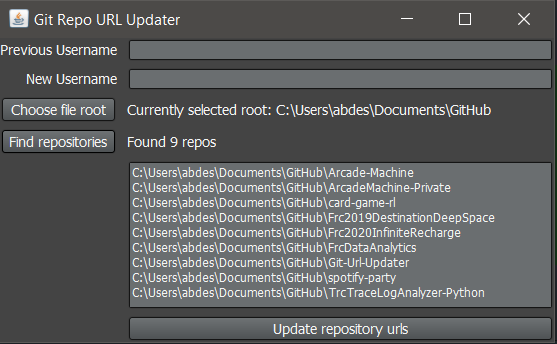

# Git-Url-Updater

When you change your GitHub username, your repository remote links to your old username will be forwarded. However, if someone else takes that username, those forwards will be broken. Therefore, it's recommended to update your repositories' remote urls to point to your new username.

However, you might have a lot of repositories, and doing it by hand is tedious. This application allows you to very easily update your repositories. It will automatically detect git repositories, and update all references from your old username to your new username.

